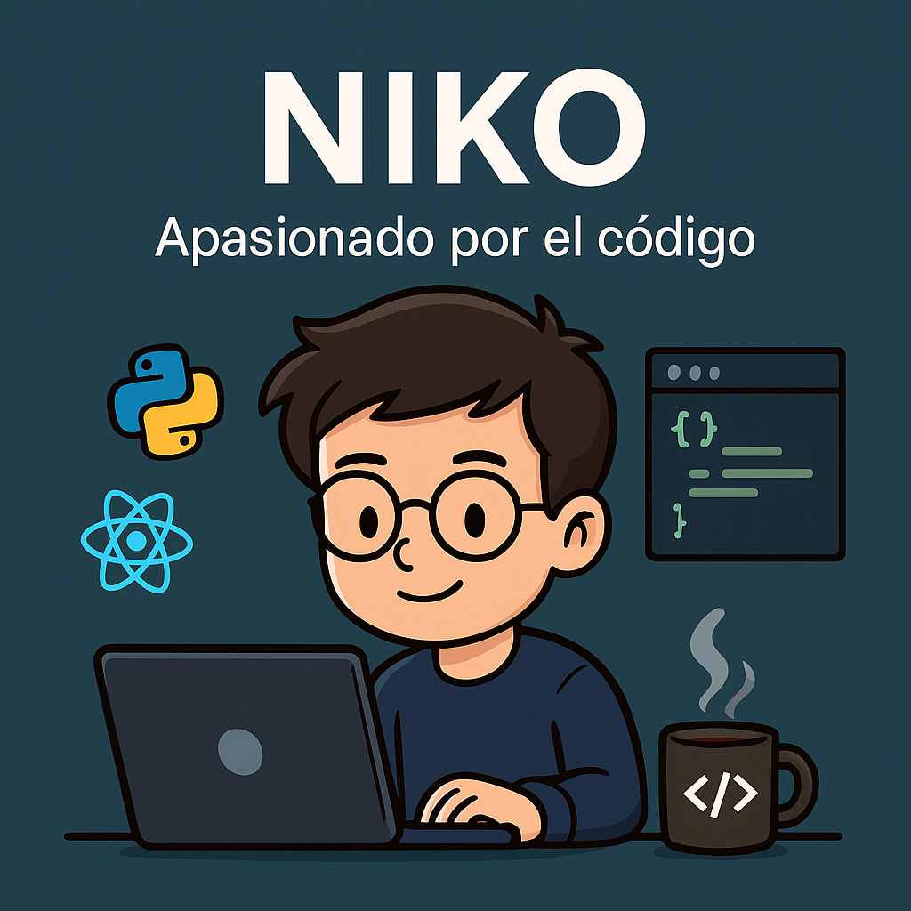

  

## 👋 ¡Hola, soy Nikoo!

### 💫 Sobre mí

¡Hola! Soy un joven programador de **18 años**, nacido en **Colombia** y actualmente viviendo en **Alemania**. Desde muy pequeño me ha apasionado la tecnología, y ahora estoy completamente enfocado en desarrollar mis habilidades como desarrollador de software. 💻✨

Me considero una persona **curiosa**, **autodidacta** y con muchísimas ganas de aprender y crecer en el mundo tech. Siempre estoy buscando nuevos retos, tecnologías por explorar y proyectos donde pueda aportar valor, seguir aprendiendo y, por qué no, sobresalir 🚀.

Estoy especialmente interesado en participar en proyectos colaborativos, contribuir a comunidades open-source y conectarme con otros apasionados del código como yo. 💬🌐

Si estás buscando a alguien con **energía, motivación** y muchas ganas de hacer las cosas bien, ¡aquí estoy! 🙌

---

### 💫 About Me

Hi there! I'm a **18-year-old** passionate programmer, originally from **Colombia** and currently living in **Germany**. From a young age, technology has fascinated me, and now I'm fully focused on developing my skills as a software developer. 💻✨

I'm a **curious, self-taught learner** with a strong desire to grow, take on challenges, and stand out through dedication and continuous improvement. I'm always looking for exciting projects where I can contribute, learn from others, and push my limits. 🚀

I'm especially interested in joining collaborative projects, contributing to **open-source** communities, and connecting with like-minded people in tech. 💬🌐

If you're looking for someone **driven, enthusiastic**, and eager to grow with your team — I'm ready to dive in and make a difference!

---

### 🛠️ Tecnologías que aprendo // Technologies ​​I learn

   

---

### 📫 Contacto // Contact
  

---

<!--
**NikooGram/NikooGram** is a ✨ _special_ ✨ repository because its `README.md` (this file) appears on your GitHub profile.

Here are some ideas to get you started:

- 🔭 I’m currently working on ...
- 🌱 I’m currently learning ...
- 👯 I’m looking to collaborate on ...
- 🤔 I’m looking for help with ...
- 💬 Ask me about ...
- 📫 How to reach me: ...
- 😄 Pronouns: ...
- ⚡ Fun fact: ...
-->
